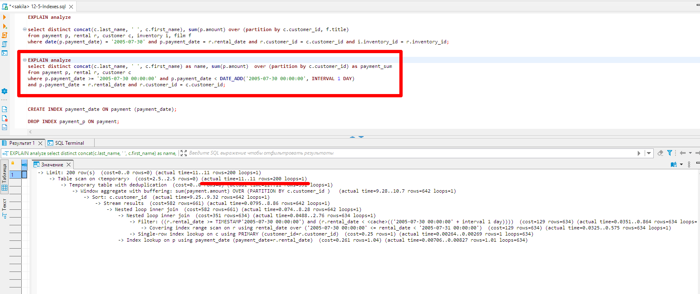

# Домашнее задание к занятию «Индексы» Андрей Дёмин


### Задание 1

Напишите запрос к учебной базе данных, который вернёт процентное отношение общего размера всех индексов к общему размеру всех таблиц.
```sql
SELECT       
ROUND((SUM(INDEX_LENGTH) / (SELECT SUM(DATA_LENGTH)
FROM INFORMATION_SCHEMA.TABLES)*100), 2) AS '% индексов в БД'  
FROM INFORMATION_SCHEMA.TABLES WHERE table_schema = 'sakila';
```


### Задание 2

Выполните explain analyze следующего запроса:
```sql
select distinct concat(c.last_name, ' ', c.first_name), sum(p.amount) over (partition by c.customer_id, f.title)
from payment p, rental r, customer c, inventory i, film f
where date(p.payment_date) = '2005-07-30' and p.payment_date = r.rental_date and r.customer_id = c.customer_id and i.inventory_id = r.inventory_id
```
- перечислите узкие места;
- оптимизируйте запрос: внесите корректировки по использованию операторов, при необходимости добавьте индексы.

<ins>Ответ</ins>:

Выполнение запроса осуществляет вывод фамилии, имени и размера платежа за определенную дату. 


При выполнении анализа запроса видно, что прогнозируемое время его исполнения при полном сканировании  составит 6584 милисекунд.


После удаления из запроса полей f.title, film.f ориентировочное время выполнения составит 15,8 милисикунд.



Был создан индекс:
```sql
CREATE INDEX payment_p ON payment (payment_id, payment_date);
```
Cодержимое запроса приведено к следующему:
```sql
select distinct concat(c.last_name, ' ', c.first_name) as name, sum(p.amount)  over (partition by c.customer_id) as payment_sum
from payment p, rental r, customer c
where p.payment_date >= '2005-07-30 00:00:00' and p.payment_date < DATE_ADD('2005-07-30 00:00:00', INTERVAL 1 DAY)
and p.payment_date = r.rental_date and r.customer_id = c.customer_id;
```
